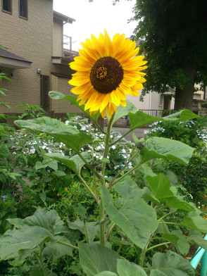

# VGG16
VGG16を使用して花の識別を行います。本サンプルでは、一度Kerasのモデルを作成し、ONNX経由でC言語へ変換します。<br>
学習用のデータとしてOXFORD大学が公開している花の分類用データを使用しています。
データ使用上のライセンスをご確認の上、ご使用ください。

- [17 Category Flower Dataset](http://www.robots.ox.ac.uk/~vgg/data/flowers/17/)

## 学習データのダウンロード
まず、Qumicoをgit cloneしたディレクトリの samples/vgg16/keras へ移動してください。
次に、下記のコマンドを実行して、学習データをダウンロードしてください。
```sh
python vgg16_generate_data.py
```

## 学習とKerasモデルの保存
花のデータを使用し、学習と学習結果の保存を行います。
次のコマンドを実行してください。

```sh
python vgg16_train.py 
```
プログラム実行後、このように表示されれば正常に終了しています。
onnxディレクトリにvgg16.onnxのファイルが生成されていれば、ONNXへの変換は成功です。

```
model/sample.hdf5 を作成しました。
onnxファイルを生成しました。出力先: onnx/sample.onnx
```


## Pythonを使った推論
Qumicoを使用してC言語に変換する前に、学習したモデルが正しく推論できるかを確認します。次のコマンドを実行してください。
```sh
python vgg16_infer.py
```



この花の写真を推論のサンプルとして使っています。結果として、次のように表示されれば成功です。後でC言語を使った推論結果と比較します。
```
Sunflower
```

## Cソースへの変換
上で生成したonnxファイルを使用し、ニューラルネットワークをCソースに変換します。次のコマンドを実行してください。

```sh
python gen_c.py 
```
このように表示されば、正常に終了しています。
```
Cソースを生成しました。出力先: out_c
```
out_cディレクトリに、includeとlibディレクトリ、qumico.cとqumico.soが出力されていれば、Cソースへの変換は成功です。

## C言語での実行
上で生成した共有ライブラリqumico.soを使って推論を実行してみます。
```sh
 python vgg16_infer_c.py 
```

このように表示され、Pythonを使った推論と同じ結果になれば、C言語で正しく推論ができています。
```
Sunflower
```
